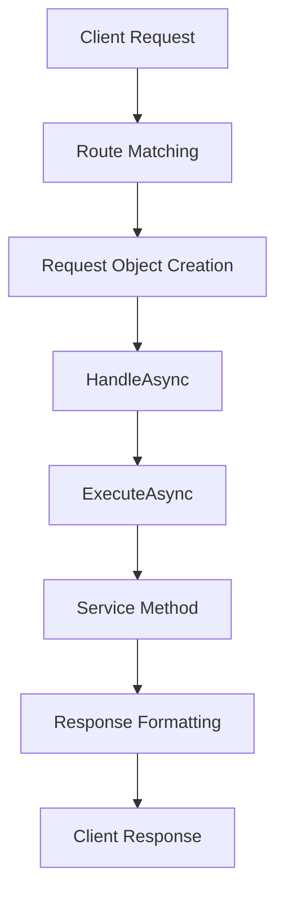

# FastEndpoints in Theta Assist: Developer's Guide

## 📋 Core Concepts

FastEndpoints is a high-performance, code-first REST API framework for ASP.NET Core that uses a vertical slice architecture. In Theta Assist, it's extended with custom base classes to provide additional functionality.

### Request Pipeline



## 🧱 Endpoint Structure

### Basic Endpoint Template

```csharp
public class MyEndpoint : ServiceEndpointBase<MyEndpoint.Request, ResponseDto>
{
    // 1. Request DTO (input parameters)
    public class Request
    {
        public string SomeId { get; set; }
        public string OtherParam { get; set; }
    }
    
    // 2. Service dependency
    public MyService Service { get; init; }
    
    // 3. Configuration (route, auth, metadata)
    public override void Configure()
    {
        Post("/api/resource/{someId}");
        Policies("AuthPolicyName");
        Options(x => x.WithTags("Category"));
    }
    
    // 4. Request handling
    public override async Task HandleAsync(Request req, CancellationToken ct)
    {
        var result = await ExecuteAsync(user => 
            Service.DoSomethingAsync(user, req.SomeId, req.OtherParam, ct));
        await SendResultAsync(result, ct);
    }
}
```

## 🔄 Request Handling Layers

### 1. HandleAsync (Framework Layer)
- **Purpose**: Entry point for requests
- **Origin**: Part of FastEndpoints core
- **Responsibility**: Receives mapped request object and initiates processing

### 2. ExecuteAsync (Service Integration Layer)
- **Purpose**: User context and error handling
- **Origin**: Custom extension in Theta Assist
- **Responsibilities**:
  - Extracts authenticated user from HttpContext
  - Passes user to service methods
  - Catches and transforms exceptions
  - Logs errors consistently

### 3. Service Method (Business Logic Layer)
- **Purpose**: Actual business logic
- **Responsibility**: Performs the requested operation

## 🧩 Base Classes

### ServiceEndpointBase
```csharp
// For standard request-response endpoints
public class MyEndpoint : ServiceEndpointBase<Request, Response> { }
```
- Standard request-response operations
- Handles success/error responses
- Converts exceptions to appropriate HTTP status codes

### SseEndpointBase
```csharp
// For streaming operations like chat
public class MyStreamingEndpoint : SseEndpointBase<Request> { }
```
- For Server-Sent Events (streaming responses)
- Long-lived connections
- Real-time updates (e.g., chat messages)

### FileEndpointBase
```csharp
// For file download endpoints
public class MyFileEndpoint : FileEndpointBase<Request> { }
```
- Handles file downloads
- Supports range requests
- Manages content type and disposition

## 🌟 ServiceResult Pattern

Theta Assist wraps service responses in a `ServiceResult<T>` class:

```csharp
// Service method return
return new FileIdResult { FileId = fileId }.ToSuccessResult();

// Error response
return ServiceResult<ExportThreadFileResult>.Unauthorized("Not permitted");

// In base class
if (result.IsSuccess)
{
    await SendOkAsync(result.Data, ct);
}
else
{
    await SendErrorsAsync(result, ct);
}
```

Benefits:
- Consistent error handling
- Standard HTTP status codes
- Error metadata and context

## 🛠 URL Routing

### Route Parameter Binding

```csharp
// In Configure()
Post("/api/assistants/{assistantId}/threads/{threadId}/export");

// In Request class
public class Request
{
    public string AssistantId { get; set; }  // Bound from URL
    public string ThreadId { get; set; }     // Bound from URL
    
    [FromBody]                               // Bound from request body
    public ExportOptions Options { get; set; }
}
```

## 🔒 Authentication & Authorization

```csharp
// In Configure()
Policies("UpnDomainPolicy");

// In ExecuteAsync
var user = HttpContext.UserInfo();
return await serviceCall(user);
```

- Authentication handled by middleware
- User passed automatically to service methods
- Authorization policies applied consistently

## 📝 Request Validation

```csharp
// Validation logic
if (string.IsNullOrEmpty(req.Name))
{
    ValidationFailures.Add(new("Name", "Name is required"));
}
ThrowIfAnyErrors();
```

## 💡 Best Practices

1. **Use HTTP Methods Correctly**
   - GET: Retrieve resources
   - POST: Create resources
   - PUT/PATCH: Update resources
   - DELETE: Remove resources

2. **Endpoint Naming Convention**
   - Verb + Noun + Endpoint
   - Examples: `GetUserEndpoint`, `CreateOrderEndpoint`

3. **Request/Response DTOs**
   - Inner class for endpoint-specific requests
   - Separate class for shared responses
   - Use annotations for documentation

4. **Service Delegation**
   - Keep business logic in services
   - Endpoints should be thin controllers
   - Reuse service methods across endpoints

5. **Error Handling**
   - Let ExecuteAsync handle common errors
   - Use ServiceResult for specific errors
   - Include meaningful error messages

6. **Documentation**
   - Add XML comments
   - Use Options(x => x.WithTags()) for Swagger grouping
   - Document request/response properties

## 📊 Examples

### GET Endpoint

```csharp
public class GetThreadMessagesEndpoint : ServiceEndpointBase<GetThreadMessagesEndpoint.Request, List<ThreadMessageDto>>
{
    public class Request
    {
        public string AssistantId { get; set; }
        public string ThreadId { get; set; }
    }
    
    public override void Configure()
    {
        Get("/api/assistants/{assistantId}/threads/{threadId}/messages/history");
        Policies("UpnDomainPolicy");
    }
    
    public override async Task HandleAsync(Request req, CancellationToken ct)
    {
        var result = await ExecuteAsync(user => 
            GetThreadMessagesAsync(user, req.AssistantId, req.ThreadId, ct));
        await SendResultAsync(result, ct);
    }
}
```

### POST Endpoint with Body

```csharp
public class CreateThreadMessageEndpoint : SseEndpointBase<CreateThreadMessageEndpoint.Request>
{
    public class Request
    {
        [FromRoute]
        public string AssistantId { get; set; }
        
        [FromRoute]
        public string ThreadId { get; set; }
        
        [FastEndpoints.FromBody]
        public CreateMessageRequest Body { get; set; }
    }
    
    public override void Configure()
    {
        Post("/api/assistants/{assistantId}/threads/{threadId}/messages");
        Policies("UpnDomainPolicy");
    }
    
    // Implementation...
}
```

## 🔄 Integration with Dependency Injection

Services are automatically injected:

```csharp
public AssistantThreadService AssistantThreadService { get; init; }
```

No constructor or manual injection needed - the framework handles it.
